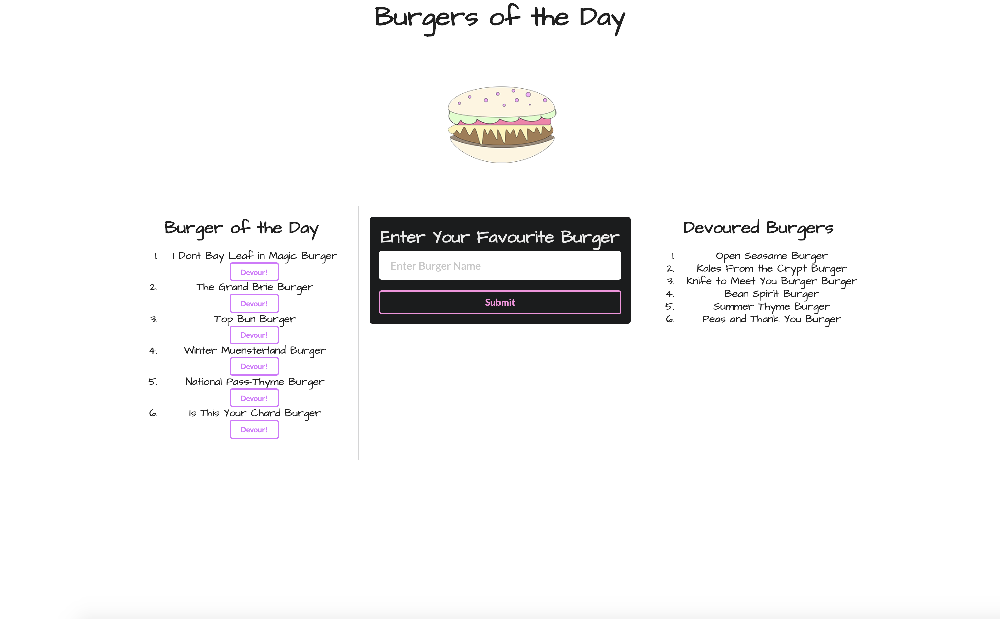

# Burger-App
## Project Description

This project is a simple application that allows the user to use the text field to enter enter their favourite burger to a server, click the devour button to move from BOTD column to Devoured Burger column.  The application is deployed on Heroku for the server to run and function properly.   

This is a responsive application that has foundation in HTML, CSS, Javascript, Node.js, mySQL & Semantic UI. It utilizes Heroku cloud service. 
## Deployment

[Burger App Heroku Application](https://young-earth-96498.herokuapp.com/)


## Table of Contents

  * [User Story](#user-story)
  * [Acceptance Criteria](#acceptance-criteria)
  * [Project Technology](#project-technology)
  * [Screenshots of Application](#screenshots-of-application)
  * [Contributing Authors](#contributing-authors)

----

  ## User Story

    ```
    AS AN Avid Burger Fan 
    I WANT to save and devour burgers
    SO THAT I know what burger I need to make next
    ```

  ## Acceptance Criteria

    ```
    GIVEN the user wants to enter a new burger
    WHEN the user types the burger name in the text field
    THEN the burger is saved to the server and displayed in the Burger of the Day Column
    WHEN the user wants to devour a burger
    THEN user clicks the devour button and the burger is moved to the Devoured Burgers Column
    ```

----

## Project Technology
<details>
    <summary markdown="span">Click to expand Project Technology Details</summary>

Languages
- HTML
- CSS
- Javascript
- Node.js
- Express.js
- mySQL


CSS Framework
- [Semantic UI](https://semantic-ui.com/)


Cloud Server
- [Heroku](heroku.com/)

</details>


## Screenshots of Application
<details>
    <summary markdown="span">Click to expand Screenshot Details</summary>


*Screenshot of Home Page*

</details>


## Contributing Author

[Lindsey Lawson](https://github.com/lynseahoss)


